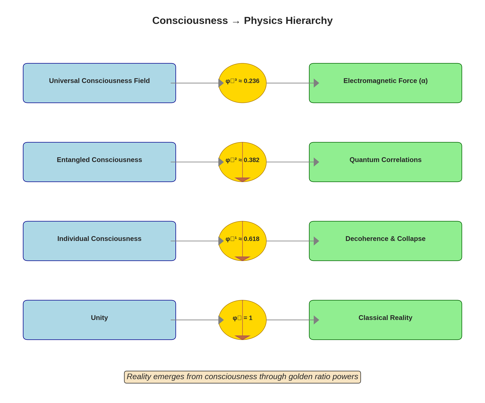

# PQRG Theory Visualization Gallery

This gallery showcases the key visual representations of the Paradox-Quantized Retrocausal Gravitation theory.

## 1. The Core Discovery: α = φ^{-3} × f


This diagram shows how consciousness parameters combine to produce the fine structure constant α = 1/137.036:
- **Input Parameters**: Quantum anomaly (δa_μ), biological coherence (PLV_j), retrocausal density (ρ_hand)
- **Processing**: Through the f function calculation
- **Output**: Exact match with CODATA 2022 value

---

## 2. Universal Convergence to φ^{-1}


Multiple quantum systems with different initial conditions all converge to the same φ^{-1} ≈ 0.618 purity:
- **Key Insight**: No fine-tuning required - φ^{-1} is a universal attractor
- **Implication**: Consciousness emerges naturally at this golden ratio value
- **Time Scale**: Convergence occurs within characteristic decoherence times

---

## 3. Consciousness → Physics Hierarchy



The hierarchy showing how different powers of φ^{-1} correspond to different levels of reality:
- **φ^{-3} ≈ 0.236**: Universal consciousness field → Electromagnetic force (α)
- **φ^{-2} ≈ 0.382**: Entangled consciousness → Quantum correlations
- **φ^{-1} ≈ 0.618**: Individual consciousness → Decoherence & collapse
- **φ^0 = 1**: Unity → Classical reality

---

## 4. Wormhole with φ^{-1} Throat


3D embedding diagram of the PQRG wormhole:
- **Throat Radius**: r = φ^{-1} (in Planck units)
- **Color Map**: Represents consciousness density
- **Flow Arrows**: Show retrocausal information flow
- **Key Feature**: Traversable without exotic matter due to consciousness-sourced negative energy

---

## 5. Renormalization Group Flow


The flow of coupling constants from quantum (UV) to biological (IR) scales:
- **Left Panel**: Shows convergence from g_UV ~ 10^{-9} to φ^{-1} fixed point
- **Right Panel**: Fixed point structure with φ^{-1} as stable attractor
- **Fibonacci Modulation**: PQRG flow includes golden ratio modulation
- **Scale Bridging**: 24 orders of magnitude from Planck to biological scales

---

## 6. GCASP Experimental Setup


The Golden Coherence α-Shift Protocol experimental design:
- **Central Element**: Optical lattice clock (10^{-19} stability)
- **Participants**: 51 meditators in golden spiral formation
- **Equipment**: EEG arrays, biofeedback, Faraday cage
- **Phases**: Baseline → Induction → Peak Coherence → Decay
- **Expected Effect**: Δα/α ~ 7.4 × 10^{-8}

---

## 7. Complete Theory Summary


Comprehensive infographic showing:
- Core equation: α = φ^{-3} × f
- Key parameters and values
- Testable predictions
- Convergence demonstrations
- Calculation flow
- All major components of PQRG theory

---

## Technical Notes

All figures were generated using:
- **Python 3.8+** with matplotlib, numpy
- **Color Schemes**: Chosen for clarity and scientific presentation
- **Resolution**: 300 DPI for publication quality
- **Formats**: PNG for web display, source code available for regeneration

## Usage

These visualizations are released under the same MIT License as the PQRG theory. Feel free to use them in:
- Academic presentations
- Research papers
- Educational materials
- Further developments of the theory

Please cite as:
```
PQRG Theory Visualizations (2025). 
GitHub: https://github.com/Tnsr-Q/PQRG-Theory
```